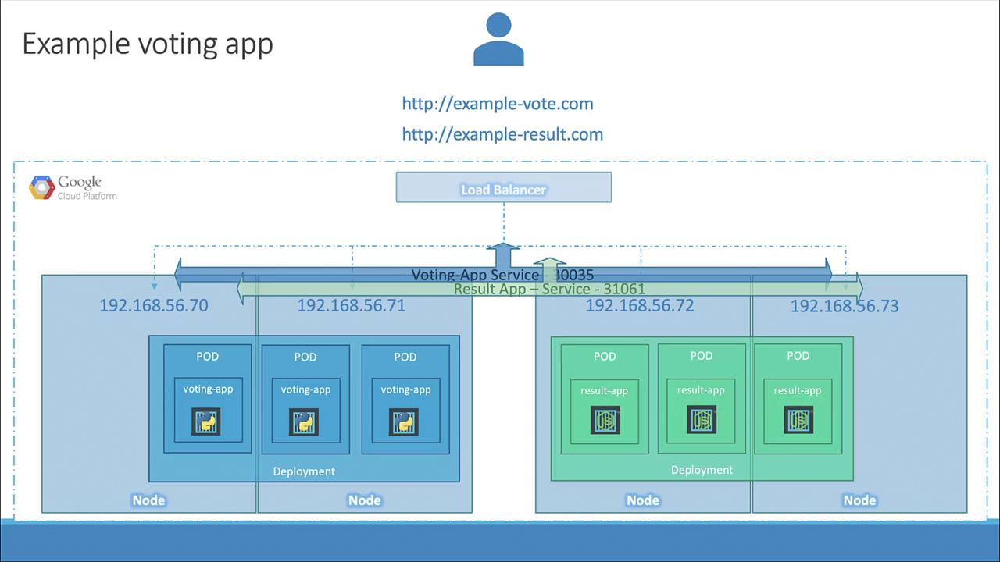

# Services Loadbalancer

[Source: KodeKloud Notes](https://notes.kodekloud.com)

Imagine that pods are distributed across a cluster - say, a three-node cluster. To allow external users to access these applications, services of type **NodePort** were created. The **NodePort** service routes incoming traffic from designated ports on the worker nodes to the corresponding pods. With **NodePort**, you can reach the applications using any node's IP address along with its high port number. For example, if the voting app and the result app are bound to different IP-port combinations, users could access the application using any node's IP address and its specified port, even if the pods are running on only two of the nodes.

> [!Important]
> While NodePort works, it forces users to remember multiple IP-port pairs, which can be incovenient.

End users typically prefer a single URL - for instance, `votingapp.com` or `resultapp.com` - rather than juggling several combinations. One approach to provide a unified entry point is to setup a dedicated virtual machine as a load balancer, using tools like **HAProxy** or **Nginx** to distribute the traffic across your nodes. However, managing an external load balancer can add complexity and overhead.

For a simpler solution, many cloud platforms such as **Google Cloud Platform (GCP), AWS, or Azure** offer integrated load balancing. When running kubernetes on one of these supported cloud environments, you can simply change the service type from *NodePort* to *LoadBalancer* for your front-end services. Kubernetes then automatically provisions and configures a cloud-native load balancer, providing a single, user-friendly URL to access your application.

Below is a diagram that illustrates a cloud-based voting app architecture on Google Cloud Platform. The image shows nodes, pods, deployments, and a load-balancer configured to handle the voting and result services.

> [!Warning]
> Keep in mind, that the **LoadBalancer** service type only functions as intended on supported cloud environments. In unsupported settings - such as VirtualBox - the **LoadBalancer** type behaves like **NodePort** by exposing the service on a high port without providing external load balancing.

