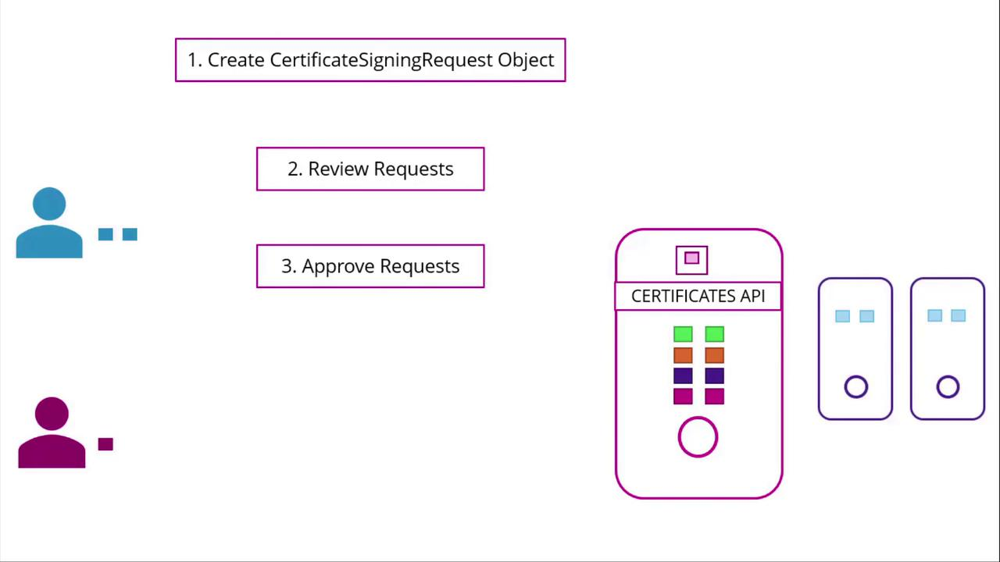

# Certificates API

[Source: KodeKloud Notes](https://notes.kodekloud.com)

This document explains managing certificates and the Certificate API in kubernetes, detailing the lifecycle of certificate signing requests and automation for certificate rotation.

In a typical cluster setup, an administrator first configures a Certificate Authority (CA) server and generates certificates for the various components. Once the services are launched with these certificates, the cluster becomes operational. Initially, only one administrator has access via a personal admin certificate and key. However, as new team members join, each must obtain their own certificate and key pair to access the cluster.

## The Certificate Lifecycle

When a new administrator joins, she generates her own private key and creates a certificate signing request (CSR). This CSR is then sent to the existing administrator. As the sole administrator, you review the CSR, sign it using the CA server’s private key and root certificate, and return the signed certificate. The new admin now has a valid certificate and key pair to access the cluster. Since certificates have a defined expiration period, the process is repeated when they expire.

The Kubernetes API Server plays a pivotal role in the cluster but is not part of the Certificate Authority. The CA is comprised of only two files—a key and a certificate—generated during initialization. Because these files allow the signing of certificates and thus the creation of users with any privileges, they must be stored securely, typically on a dedicated CA server. In many implementations, the Kubernetes master node also serves as the CA server. For instance, the kubeadm tool creates and stores CA files on the master node.

> [!Important]
> As the number of users increase, manually signing certificate requests becomes impractical. Kubernetes addresses this challenge with a built-in Certificates API that automates CSR management and certificate rotation.

## Managing Certificate Signing Requests (CSRs)

The Kubernetes Certificates API allows users to submit their CSRs via an API call, creating a **CertificateSigningRequest** object. Administrators can then review and approve these requests using `kubectl` commands. Once approved, Kubernetes signs the certificate using the CA’s key pair. The signed certificate is then available for extraction and distribution to the requesting user.



1. **User Generates Private Key and CSR**
   A user creates a private key and generates a certificate signing request using the following command:

```bash
openssl genrsa -out john.key 2048
```

2. **Administrator Creates a CSR Object**
   The administrator creates a **CertificateSigningRequest** object with a manifest file. In the manifest, the `Kind` is set to `CertificateSigningRequest`, and the `spec` section includes the encoded certificate signing request (CSR must be encoded in base64). Below is an example manifest:

```yaml
apiVersion: certificates.k8s.io/v1
kind: CertificateSigningRequest
metadata:
  name: jane
spec:
  expirationSeconds: 600 # seconds
  usages:
    - digital signature
    - key encipherment
    - server auth
  request: LS0tLS1CRUdJTiBDRVJUSU...
```

Administrators can list pending CSRs with the following command:

```bash
kubectl get csr
```

The output may resemble:

```
NAME      AGE   SIGNERNAME                                   REQUESTOR                  REQUESTEDDURATION   CONDITION
jane      10m   kubernetes.io/kube-apiserver-client         admin@example.com          10m                 Pending
```

3. **Approving the CSR**
   To approve the CSR, run:

```bash
kubectl certificate approve john
```

After approval, Kubernetes signs the CSR with the CA key pair, and the certificate is embedded in the **CertificateSigningRequest** object’s YAML output as a base64 encoded string. You can decode it using base64 utilities to view the plain text certificate.

Below is an example of a **CertificateSigningRequest** object:

```yaml
apiVersion: certificates.k8s.io/v1
kind: CertificateSigningRequest
metadata:
  creationTimestamp: 2019-02-13T16:36:43Z
  name: new-user
spec:
  groups:
    - system:masters
    - system:authenticated
  expirationSeconds: 600
  usages:
    - digital signature
    - key encipherment
    - server auth
  username: kubernetes-admin
status:
  certificate: L$0tL1CRUdJTiBDRVJ....
  conditions:
    - lastUpdateTime: 2019-02-13T16:37:21Z
      message: This CSR was approved by kubectl certificate approve.
      reason: KubectlApprove
      type: Approved
```

## The Role of the Controller Manager

Within the kubernetes control plane, components such as the API Server, Scheduler, and Controller Manager work together. However, all certificate-related operations- such as CSR approval and signing- are managed by the Controller Manager.

The Controller Manager includes dedicated controllers for CSR approval and CSR signing tasks. Since signing certificates requires access to the CA's root certificate and private key, its configuration specifies the file paths to these credentials. For example, the Controller Manager's configuration file might include settings like the following:

```bash
cat /etc/kubernetes/manifests/kube-controller-manager.yaml
spec:
  containers:
  - command:
      - kube-controller-manager
      - --address=127.0.0.1
      - --cluster-signing-cert-file=/etc/kubernetes/pki/ca.crt
      - --cluster-signing-key-file=/etc/kubernetes/pki/ca.key
      - --controllers=*,bootstrapsigner,tokencleaner
      - --kubeconfig=/etc/kubernetes/controller-manager.conf
      - --leader-elect=true
      - --root-ca-file=/etc/kubernetes/pki/ca.crt
      - --service-account-private-key-file=/etc/kubernetes/pki/sa.key
      - --use-service-account-credentials=true
```

This configuration demonstrates how the Controller Manager accesses the necessary CA certificates for signing new certificate requests.

## Conclusion

In summary, Kubernetes simplifies certificate management through its built-in Certificates API, automating the CSR lifecycle and certificate rotation. This automation is essential for maintaining secure access as team sizes grow and certificates expire over time.
