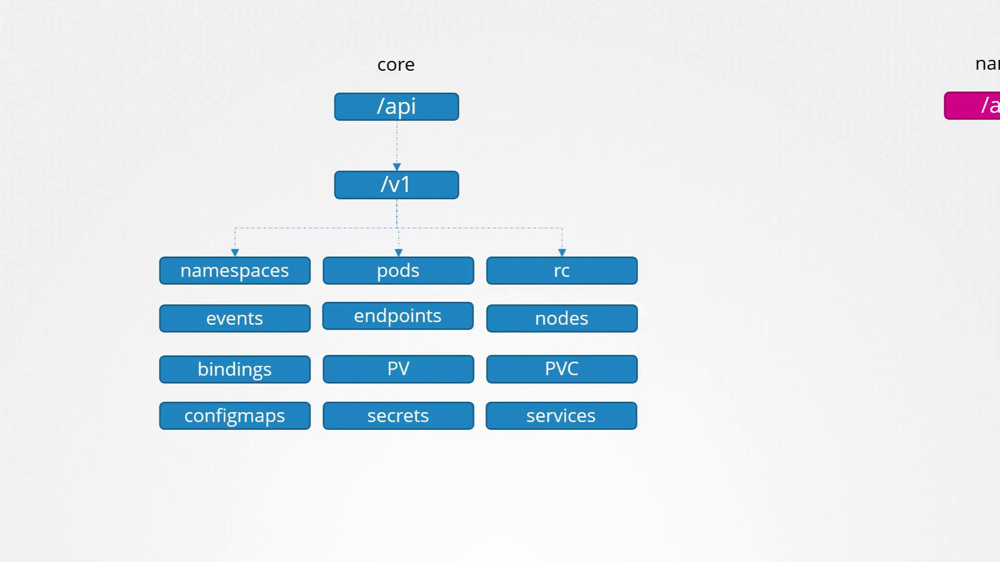
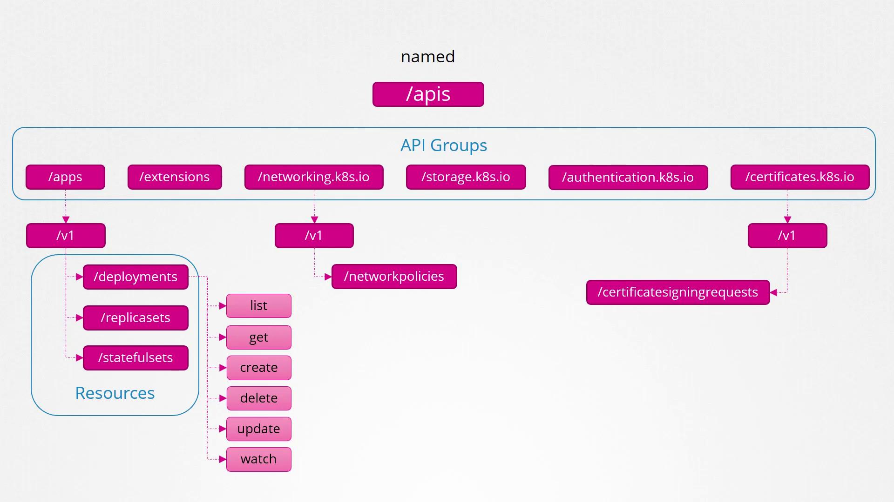

# API Groups

[Source: KodeKloud Notes](https://notes.kodekloud.com)

This document provides an in-depth look into Kubernetes API groups, their structure, and methods for querying the API server.

## Understanding the Kubernetes API

The Kubernetes API is the primary interface for interacting with your cluster. Whether using the command-line tool kubectl or directly sending HTTP requests via REST, every interaction communicates with the API server. For example, to check your cluster’s version, run:

```bash
curl https://kube-master:6443/version
```

The response may look like:

```json
{
  "major": "1",
  "minor": "13",
  "gitVersion": "v1.13.0",
  "gitCommit": "ddf47ac13c1a9483ea035a79cd7c1005ff21a6d",
  "gitTreeState": "clean",
  "buildDate": "2018-12-03T20:56:12Z",
  "goVersion": "go1.11.2",
  "compiler": "gc",
  "platform": "linux/amd64"
}
```

Likewise, listing pods in the cluster involves accessing the `/api/v1/pods` endpoint.

## API Groups and Their Purpose

Kubernetes organizes its API into multiple groups based on specific functionality. These groups help in managing versioning, health metrics, logging, and more. For instance, the `/version` endpoint provides cluster version data, while endpoints like `/metrics` and `/healthz` offer insights into the cluster’s performance and health.

| API Groups |
| ---------- |
| `/metrics` |
| `/healthz` |
| `/version` |
| `/api`     |
| `/apis`    |
| `/logs`    |

1. **Core API Group**:
   Contains the essential features of Kubernetes such as namespaces, pods, replication controllers, events, endpoints, nodes, bindings, persistent volumes, persistent volume claims, config maps, secrets, and services.

   

2. **Named API Groups**:
   Provides an organized structure for newer features. These groups include apps, extensions, networking, storage, authentication, and authorization. For example, under the apps group, you’ll find Deployments, ReplicaSets, and StatefulSets, whereas the networking group hosts resources such as Network Policies. Certificate-related resources like Certificate Signing Requests are also grouped under their relevant named groups.
   

## Querying the API Server

To retrieve the list of available API groups, access the API server’s root endpoint on port 6443:

```bash
curl http://localhost:6443 -k \
  --key admin.key \
  --cert admin.crt \
  --cacert <your-ca-cert-file>
```

The command returns a JSON response similar to:

```json
{
  "paths": [
    "/api",
    "/api/v1",
    "/apis",
    "/apis/",
    "/healthz",
    "/logs",
    "/metrics",
    "/openapi/v2",
    "/swagger-2.0.0.json"
  ]
}
```
