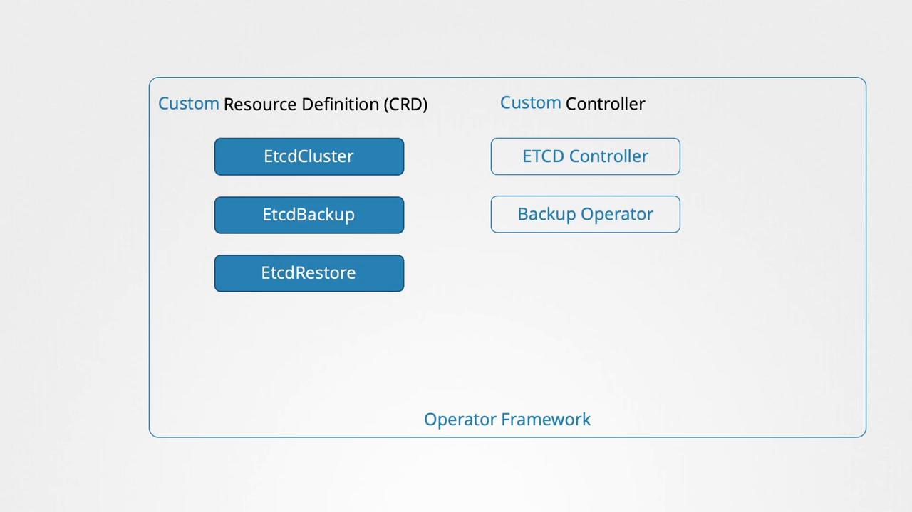

# Operator Framework

[Source: KodeKloud Notes](https://notes.kodekloud.com)

In this document, we dive into the operator framework and explore how it simplifies the deployment and management of Kubernetes resources. Previously, we discussed creating a Custom Resource Definition (CRD) and a custom controller to handle resource-specific logic. Traditionally, these components are deployed separately: you first create the CRD and its related resources, and then deploy the controller as a pod or as part of a deployment. With the operator framework, you can package both components into a single deployable entity.

When you deploy the flight operator, it automatically creates the Custom Resource Definition, provisions the required resources, and deploys the custom controller as a Deployment. Consider the following example:

```yaml
# flightticket-custom-definition.yml
apiVersion: apiextensions.k8s.io/v1
kind: CustomResourceDefinition
metadata:
  name: flighttickets.flights.com
spec:
  scope: Namespaced
  group: flights.com
  names:
    kind: FlightTicket
    singular: flightticket
    plural: flighttickets
    shortnames:
      - ft
  versions:
    - name: v1
      served: true
      storage: true
```

Below is an example of the custom controller written in Go. This controller monitors and synchronizes the state of FlightTicket resources within your Kubernetes cluster:

```go
package flightticket

import "k8s.io/api/apps/v1"

var controllerKind = v1.SchemeGroupVersion.WithKind("Flightticket")

// Run begins watching and syncing.
func (dc *FlightTicketController) Run(workers int, stopCh <-chan struct{}) {}

// callBookFlightAPI invokes the Book Flight API for a ReplicaSet.
func (dc *FlightTicketController) callBookFlightAPI(obj interface{}) {}
```

To deploy the operator, simply run:

```bash
kubectl create -f flight-operator.yaml
```

> [!Important]
> The operator framework not only streamlines resource deployment but also simplifies ongoing management tasks such as application updates, backups and recovery.

One of the most popular examples is the etcd operator. It deploys and manages an etcd cluster within Kubernetes using a dedicated CRD and a custom controller that observes changes in the etcd cluster resource. Additionally, it supports extended functionalities such as taking backups and executing restores, simply by creating supplementary CRDs. Backup and Restore operators enhance these capabilities further.



Kubernetes operators handle tasks that would typically require manual intervention by system administrators. These tasks include application installation, routine maintenance, backup operations, disaster recovery through data restoration, and troubleshooting.

For a comprehensive list of available operators, visit the [Operator Hub](https://operatorhub.io). Many popular applications—such as etcd, MySQL, Prometheus, Grafana, Argo CD, and Istio—have dedicated operators with detailed installation instructions accessible via an install button.
​

## How to Deploy an Application Using an Operator

Deploying an application with an operator is an easy process that typically involes:

1. Installing the Operator Lifecycle Manager
2. Deploying the operator
3. Enjoying streamlined application management

The following commands show you how to install the Operator Lifecycle Manager, and deploy the etcd-operator for hands-on practive:

```bash
# Install the Operator Lifecycle Manager
curl -sL https://github.com/operator-framework/operator-lifecycle-manager/releases/download/v0.19.1/install.sh | bash -s v0.19.1

# Deploy the etcd operator
kubectl create -f https://operatorhub.io/install/etcd.yaml

# Retrieve the installed Cluster Service Version in the "my-etcd" namespace
kubectl get csv -n my-etcd
```
