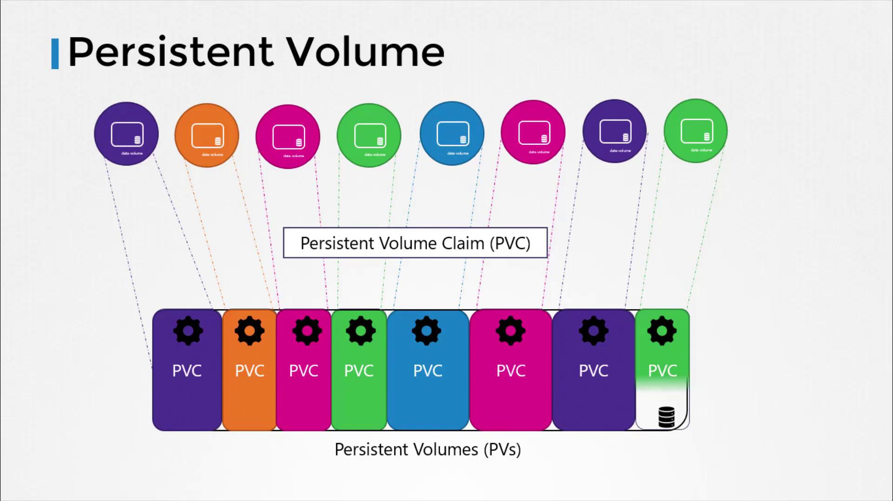

# Persistent Volumes

[Source: KodeKloud Notes](https://notes.kodekloud.com)

In this document, we will explore how to centralize storage management in Kubernetes using persistent volumes.

Before we discussed how volumes are defined within pod manifest files, where the storage settings are directly included in each pod definition. For example, a typical pod configuration with a volume might look like:

```yaml
volumes:
  - name: data-volume
    awsElasticBlockStore:
      volumeID: <volume-id>
      fsType: ext4
```

In environments, where many users deploy multiple pods, duplicating storage configuration in every pod file can lead to redundancy and increased maintenance efforts. Any required change would need to be propagated across all pod definitions.

To solve this issue, administrators can create a centralized pool of storage. Users the requets portions of this storage as needed by creating persistent volume claims (PVCs). This concept is enabled by persistent volumes (PVs).

A **Persistent Volume** is a cluster-wide storage resource defined and managed by an administrator. Applications running on the cluster utilize these PVs by binding to them via **Persistent Volume Claims (PVCs)**.



## Creating a Persistent Volume

In this section, we will create a persistent volume using a base template. First, update the API version, set the kind to PersistentVolume, and give it a name (for example, “pv-vol1”). Under the spec section, it’s necessary to define the access modes. The access modes determine how a volume can be mounted on nodes, such as:

- **ReadWriteOnce**: The volume can be mounted as read-write by a single node.
- **ReadOnlyMany**: The volume can be mounted as read-only by multiple nodes.
- **ReadWriteMany**: The volume can be mounted as read-write by multiple nodes.

Below is an initial portion of the configuration that defines the persistent volume along with its access mode:

```yaml
apiVersion: v1
kind: PersistentVolume
metadata:
  name: pv-vol1
spec:
  accessModes:
    - ReadWriteOnce
```

Next, specify the storage capacity for this persistent volume. In our example, we set the capacity to 1 Gi. After defining the capacity, choose the volume type. Here, we use the **hostPath** option, which leverages storage from the node's local directory.

> [!Important]
> The `hostPath` option is primarily for testing or single-node setups and is not recommended for production environments.

The complete persistent volume manifest appears as follows:

```yaml
apiVersion: v1
kind: PersistentVolume
metadata:
  name: pv-vol1
spec:
  accessModes:
    - ReadWriteOnce
  capacity:
    storage: 1Gi
  hostPath:
    path: /tmp/data
```

To create the persistent volume, execute the following command:

```bash
kubectl create -f pv-d
```

After creating the volume, you can verify its status by running:

```bash
kubectl get persistentvolume
```

In a production setup, replace the hostPath option with a supported storage solution, such as AWS Elastic Block Store, to ensure data durability and scalability.
