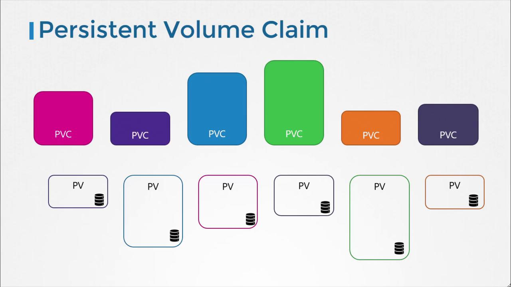
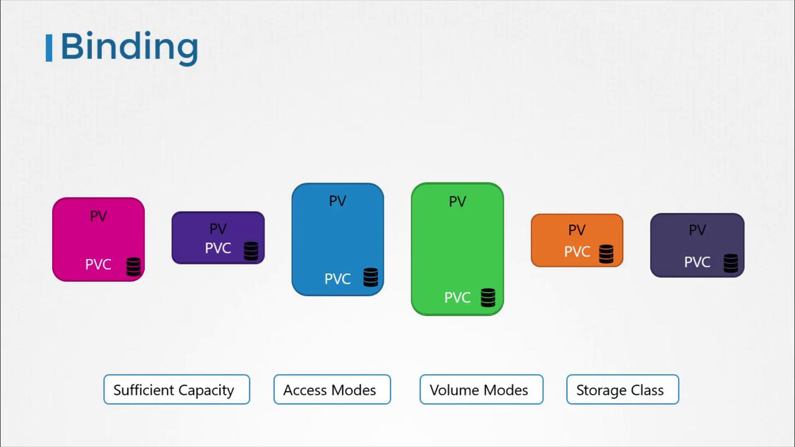
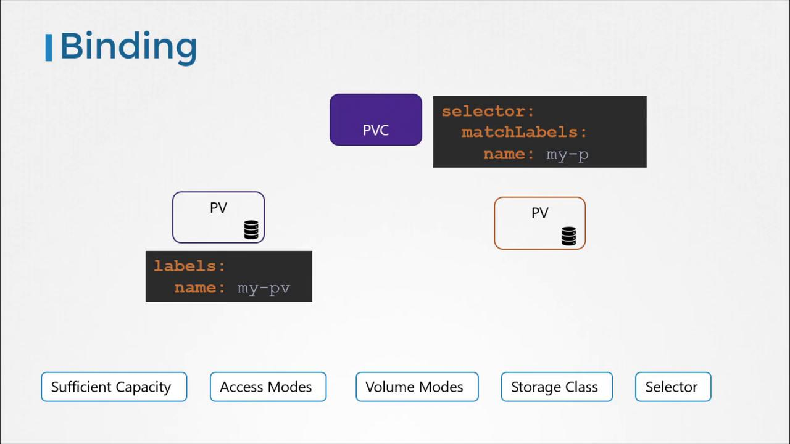

# Persistent Volume Claims

[Source: KodeKloud Notes](https://notes.kodekloud.com)

This document explains how to create and manage Persistent Volume Claims in Kubernetes, including binding, deletion and reclaim policies.

Before, we created a Peristent Volume (PV). Now we will explore how to create a Persistent Volume Claim (PVC) to expose that storage to a node.

Persistent Volumes and Persistent Volume Claims are two distinct objects in Kubernetes. An administrator is responsible for creating PVs, while users create PVCs to request storage resources. When a PVC is created, Kubernetes automatically binds it to a PV that meets the requested capacity, access modes, volumes modes and storage class.



Kubernetes evaluates several factors when binding a PVC to a PV. If multiple PVs can satisfy a claim, you can use labels and selectors to bind the claim to a specific volume.



It is important to note that if a smaller PVC is matched with a larger PV that meets all criteria, the unrequested capacity remains unused by any other PVC. If no PV satisfies the claim’s requirements, the PVC will remain in a pending state until a new, suitable PV becomes available.



## Creating a Persistent Volume Claim

Below is an example YAML template for creating a PVC. In this configuration, we set the API version to v1 with kind PersistentVolumeClaim, and name it “myclaim”. Under the specification section, the access mode is set to ReadWriteOnce, and 500 MiB of storage is requested.

```yaml
apiVersion: v1
kind: PersistentVolumeClaim
metadata:
  name: myclaim
spec:
  accessModes:
    - ReadWriteOnce
  resources:
    requests:
      storage: 500Mi
```

To create the PVC:

1. Save the above YAML to a file, for example, `pvc-definition.yaml`
2. Run the command below in your terminal:

```bash
kubectl create -f pvc-definition.yaml

kubectl get persistentvolumeclaim
```

Kubernetes will inspect the available PV. Suppose, in our example, a PV is configured with 1GiB storage and compatible access modes — if it meets the PVC’s criteria, it will automatically bind to the PVC. Here is an example of such a PV definition:

```yaml
apiVersion: v1
kind: PersistentVolume
metadata:
  name: pv-voll
spec:
  accessModes:
    - ReadWriteOnce
  capacity:
    storage: 1Gi
  awsElasticBlockStore:
    volumeID: <volume-id>
    fsType: ext4
```

After the binding process, running the `kubectl get persistentvolumeclaim` command will show that the PVC has been successfully bind to the matching PV.

## Deleting a PVC and Persistent Volume Reclaim Policies

To delete a PVC, use the following command:

```bash
kubectl delete persistentvolumeclaim myclaim
```

When a PVC is deleted, what happens next depends on the underlying persistent volume's reclaim policy. The reclaim policy determines the fate of the PV and can be configured as follows:

| **Reclaim Policy** | **Description**                                                                                   |
| ------------------ | ------------------------------------------------------------------------------------------------- |
| Retain             | The PV remains in the cluster after the PVC is deleted. An administrator must manually reclaim it |
| Delete             | The PV is automatically deleted along with the PVC, releasing the storage on the physical device  |
| Recycle            | The PV data is scrubbed before reuse by new claims                                                |

> [!Important]
> The "Recycle" reclaim policy is deprecated in recent Kubernetes versions and might not be available in your cluster.

For example, to set the reclaim policy to Retain, you would include:

```yaml
persistentVolumeReclaimPolicy: Retain
```

Choose the reclaim policy that best fits your storage management strategy.
